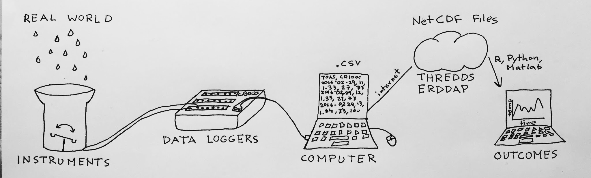
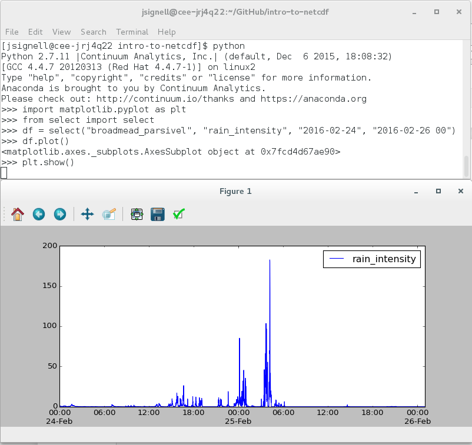
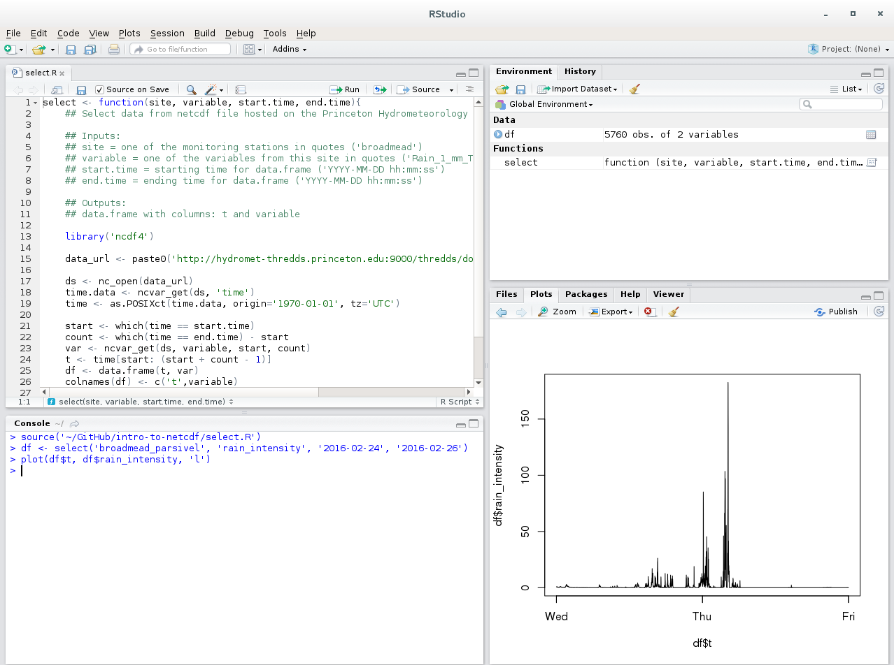
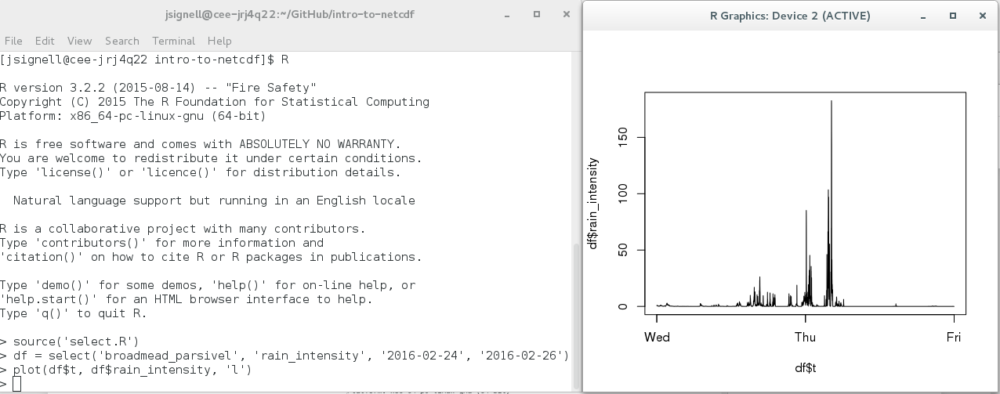
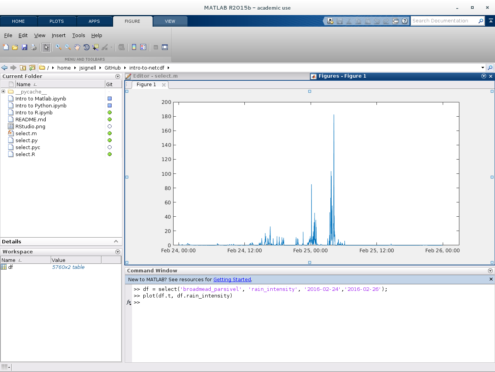

# Introduction to NetCDF

NetCDF files are used for storing self-describing data in a consise and consistent way. If you have never encountered a NetCDF file before, they can seem daunting. If you want a quick and friendly way of looking at the data you should try out [Panoply](http://www.giss.nasa.gov/tools/panoply/). Or see if the files that you are interested in are already hosted on an in-browser viewing tool such as [ERDDAP](http://hydromet-thredds.princeton.edu:8000/erddap/info/index.html?page=1&itemsPerPage=1000)

If you are ready to dive in and get started with analysis, then choose your language, get set up, and check out the introductory materials. 

[Python](#python) | [R](#r) | [Matlab](#matlab)
#### Choosing a language
This repository contains introductory materials for Python, R, and Matlab. These are the giants in data analysis in the scientific and engineering communities. As an overview: Python is an opensource language with a broad base of support and can be used for development as well as data analysis, R is an opensource statistics-focused language, and Matlab is a proprietary language with great support and easy startup (no installing packages). Choosing which to use can be hard, but there is no reason to limit yourself to one. If you really dive in, you will find that the best tool for the job isn't always just one of the languages, but some combination. If you are interested in reading more about the nitty gritty of the difference between R and Python check out [this datacamp blog post](http://www.datacamp.com/community/tutorials/r-or-python-for-data-analysis), Python and Matlab check out [this pyzo blog post](http://www.pyzo.org/python_vs_matlab.html).

#### Choosing an environment
For the purposes of this introduction, all the code in this repository is run in [Jupyter](http://jupyter.org) notebooks. Jupyter is my favorite development environment and lends itself to linear explanations, but there are different and often more typical environments depending on the language you choose to use. All of the commands in the notebooks will work just the same no matter where you use them, whether at the command line or in a console window within an environment. Just copy and paste the lines that you want to run from the notebook and make sure that if you are depending on outside functions (select.py, select.R, or select.m) those files are saved in the same folder where you are working. Descriptions of different environments and instructions for setup are included below. 

[Python](#python) | [R](#r) | [Matlab](#matlab)
### [Python](http://nbviewer.jupyter.org/github/jsignell/intro-to-netcdf/blob/master/Intro%20to%20Python.ipynb)

There are several packages that you will want to install before you start anaylsis with python. If you are already confortable with python, then install [netCDF4](http://unidata.github.io/netcdf4-python/) and [xarray](http://xarray.pydata.org), both are availble on conda. If you don't alreay have them installed, you will also want to install [matplotlib](http://matplotlib.org) for graphing, and [pandas](http://pandas.pydata.org) for data analysis. 

If you aren't comfortable already, then the easiest way is to get [miniconda](http://conda.pydata.org/miniconda). I recommend Python 2.7, but Python 3 works too. Then go to the command line and run:

    $ conda install netCDF4 xarray matplotlib pandas

Jupyter is my favorite development environment, but there are many other environments in which you can run Python (some popular ones: [Spyder](http://github.com/spyder-ide/spyder/blob/master/README.md), [PyCharm](http://www.jetbrains.com/pycharm/)). To install Jupyter just run:

    $ conda install jupyter

To start it, open a command window in the folder in which you want to store your notebooks and run:

    $ jupyter notebook
    
There is also always the option of running Python directly from the terminal. If you choose that route, this is what your work environment will look like:

[Python](#python) | [R](#r) | [Matlab](#matlab)
### [R](http://nbviewer.jupyter.org/github/jsignell/intro-to-netcdf/blob/master/Intro%20to%20R.ipynb)

As with python, there is one package that you will need, and several others that will make analysis easier. If you are comfortable with R, then install [ncdf4](http://cran.r-project.org/web/packages/ncdf4). To make time management easier install [xts](http://cran.r-project.org/web/packages/xts), and to make plotting easier install [ggplot2](http://cran.r-project.org/web/packages/ggplot2). 

If you don't yet have [R](https://cran.r-project.org/), download it and follow the install instructions.

If you want to work from the command line run: 

    $ install.packages('ncdf4')
    $ install.packages('xts')
    $ install.packages('ggplot2')

If you want a more user-friendly environment, try the free version of [RStudio](http://www.rstudio.com/products/rstudio/download/) and use the package manager to install **ncdf4**,  **xts**, and **ggplot2**. There are some nice tools for inspecting data tables and saving plots in a more familiar way. This is what your work environment will look like if you choose to use RStudio:

If instead you choose to run R directly from the terminal, your environment will look more like this:

[Python](#python) | [R](#r) | [Matlab](#matlab)
### [Matlab](http://nbviewer.jupyter.org/github/jsignell/intro-to-netcdf/blob/master/Intro%20to%20Matlab.ipynb)

Unlike the other two languages, matlab requires a license. If you already have Matlab you are all set to move forward. 

Matlab comes with its own user interface which has some helpful tools for inspecting data in table form and changing how plots look. If you use the Matlab user interface, this is what your work environment will look like:

If for whatever reason you are interested in getting Jupyter set up to run Matlab, just download [miniconda](http://conda.pydata.org/miniconda) and run:

    $ conda install jupyter -c ioos matlab_kernel
    
To start it, open a command window in the folder in which you want to store your notebooks and run:

    $ jupyter notebook

You should notice a Matlab option when selecting which kernel to use in a notebook. 
